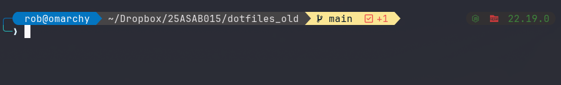

<div align = "center">

<h1><a href="https://25ASAB015.github.io/posh">Roberto Flores oh-my-posh</a></h1>

<a href="https://github.com/25ASAB015/posh/blob/main/LICENSE">
 </a>

<a href="https://github.com/25ASAB015/posh/graphs/contributors">
 </a>

<a href="https://github.com/25ASAB015/posh/stargazers">
</a>

<a href="https://github.com/25ASAB015/posh/network/members">
 </a>

<a href="https://github.com/25ASAB015/posh/watchers">
 </a>

<a href="https://github.com/25ASAB015/posh/pulse">
 </a>

<h3>Universal prompt for Power users 💪</h3>

<figure>
  
  <br/>
  <figcaption>posh screenshot</figcaption>
</figure>

</div>

## What is this

posh is a prompt for [oh-my-posh](https://ohmyposh.dev/), it works on all shells, has multiple segments with aesthetically pleasing colors.

## Inspiration

Most of my workflow is based on the command line, recently I had to use a Windows system for some work and was really displeased by the CLI experience.

So, I needed a prompt that can work across shells and has support for different segments and posh was born.

## Prerequisites

Before you begin, ensure you have met the following requirements:

- You have installed the latest version of [oh-my-posh](https://ohmyposh.dev/docs/installation/linux)

## Getting posh

To get posh, follow these steps:

```bash
git clone https://github.com/25ASAB015/posh/

# for Powershell, add this to $Profile
oh-my-posh init pwsh --config ~/PATH_TO_DIR/posh/rob.omp.json | Invoke-Expression

# for Zsh, add this to ~/.zshrc
eval "$(oh-my-posh init zsh --config ~/PATH_TO_DIR/posh/rob.omp.json)"

# for Bash, add this to ~/.bashrc
eval "$(oh-my-posh init bash --config ~/PATH_TO_DIR/posh/rob.omp.json)"

# for Fish, add this to ~/config/fish/config.fish
oh-my-posh init fish --config ~/PATH_TO_DIR/posh/rob.omp.json | source

# for nu shell, run
oh-my-posh init nu --config ~/PATH_TO_DIR/posh/rob.omp.json
source ~/oh-my-posh.nu

# for cmd, install Clink, then add this
load(io.popen('oh-my-posh init cmd --config ~/PATH_TO_DIR/posh/rob.omp.json'):read("*a"))()

```

## Challenges faced

Going through the docs and understanding different segments.

Hit the ⭐ button if you found this useful.

## More Info

<div align="center">

<a href="https://github.com/25ASAB015/posh">Source</a> 

</div>
